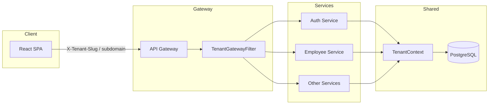
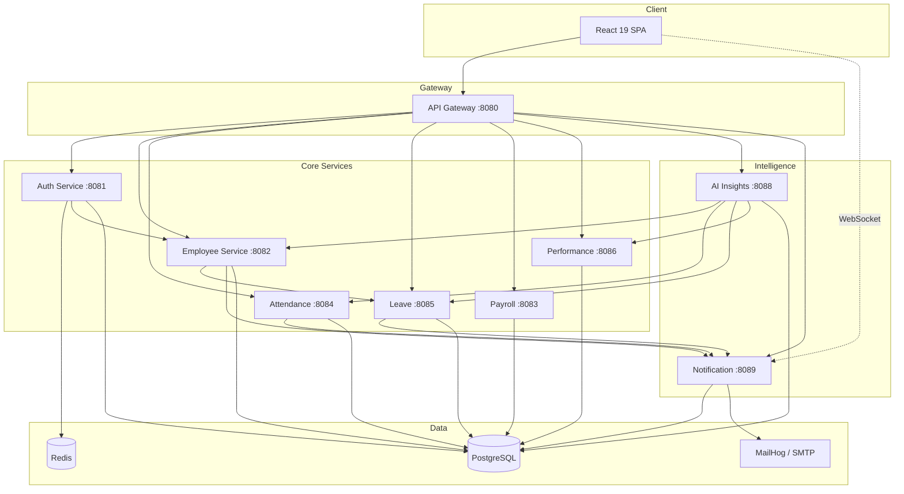
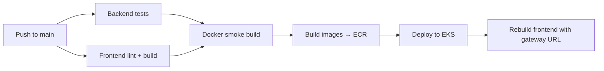

# NexusHR — AI-Enabled Enterprise HR & Workforce Intelligence Platform

<div align="center">

### *One Platform. Every Employee Journey. AI-Powered Decisions.*

[](https://openjdk.org/)
[](https://spring.io/projects/spring-boot)
[](https://reactjs.org/)
[](https://www.postgresql.org/)
[](https://aws.amazon.com/eks/)
[](https://kubernetes.io/)
[](#license)

**Zidio Development · June 2026**

</div>

---

## Overview

**NexusHR** is a production-oriented, microservices-based HR platform for modern enterprises. It unifies day-to-day HR operations with AI workforce intelligence so HR teams, managers, and employees work from one secure, tenant-isolated system instead of scattered spreadsheets and tools.

| Metric | Value |
|:-------|:------|
| Microservices | **9** backend services + API gateway |
| RBAC roles | **5** (Platform Admin, Admin, HR, Manager, Employee) |
| AI modules | Attrition, engagement, skill gaps, assistant, exports |
| Real-time | WebSocket in-app notifications + email |
| Deployment | Docker, Kubernetes (EKS), GitHub Actions CI/CD |

### Who it is for

| Persona | Capabilities |
|:--------|:-------------|
| **HR teams** | Hire, onboard, offboard, announcements, payroll operations |
| **Managers** | Approve leave, review performance, monitor team health |
| **Employees** | Attendance, leave, payslips, profile, self-service workspace |
| **Admins** | Full tenant access, lifecycle, analytics, workforce command center |
| **Leadership** | Attrition risk, engagement scores, department analytics, exports |

### Problems solved

| Before NexusHR | With NexusHR |
|:---------------|:-------------|
| Manual onboarding checklists | Automated multi-step onboarding pipeline |
| No visibility into attrition risk | AI attrition and engagement scoring |
| Disconnected leave / payroll / attendance | Integrated microservices with notifications |
| HR-only data silos | Role-based dashboards for every persona |
| Single-company tools | **Multi-tenant SaaS** with isolated workspaces |
| No audit trail on HR actions | JWT auth, RBAC, tenant-scoped data access |

---

## Key features

### Employee lifecycle
- HR **Add Employee** form (login + profile + onboarding)
- Multi-step onboarding checklist (PROBATION → ACTIVE)
- Document upload (identity, tax, general)
- Offboard with login disable
- Mandatory password change for newly hired users
- Self-service workspace activation

### Time & attendance
- Clock in / clock out
- Daily attendance records
- Manager and HR visibility
- Real-time notifications on punch events

### Leave management
- Submit, approve, reject, cancel leave
- Leave balance tracking per type
- Manager approval workflow
- Email and in-app alerts on status change

### Payroll
- Salary structures and payslip generation
- Employee payslip view and download
- HR payroll operations console
- INR-ready compensation breakdown

### Performance
- Quarterly reviews and 360° feedback
- Manager review operations console
- Scorecards and trend analytics
- Peer / self / manager feedback types

### AI workforce intelligence
- Attrition risk predictions
- Engagement scoring
- Skill gap analysis
- Nexus AI assistant with intent-based workforce Q&A
- Dedicated attrition / engagement / skills insights pages
- PDF and Excel workforce report export
- Scheduled report delivery

### Multi-tenant SaaS
- Company self-registration (`/register`)
- Isolated workspaces per organization (tenant slug)
- Subscription plans with seat tracking (Starter plan)
- Tenant resolution via `X-Tenant-Slug` header, email domain, or subdomain
- Demo seed data for multiple companies (`nexushr`, `beans`, `klearnow`)

### Notifications
- In-app notification bell
- WebSocket real-time push
- Email delivery (MailHog locally, SMTP in production)
- HR broadcast announcements

---

## Multi-tenant architecture

NexusHR uses a **shared-database, tenant-scoped** model. Every organization is an `Organization` with a unique slug. All users, employees, and HR data are scoped to a tenant.



### Tenant resolution

| Method | Example |
|:-------|:--------|
| HTTP header | `X-Tenant-Slug: beans` |
| Email domain (demo) | `hr@beans.ai` → tenant `beans` |
| Subdomain (production) | `beans.nexushr.com` → tenant `beans` |
| JWT claims | `tenantSlug` embedded in access token |

Shared tenant utilities live in `nexusHR-common` (`TenantContext`, `TenantHeaders`, `TenantContextFilter`).

### Company registration flow

1. Admin visits `/register` and creates a workspace (company name + slug).
2. Backend creates organization, starter subscription, and admin user.
3. Admin logs in and invites HR / employees via lifecycle or signup.
4. All API calls are scoped to that tenant automatically.

---

## Role-based access (RBAC)

| Role | Scope | Key capabilities |
|:-----|:------|:-----------------|
| **PLATFORM_ADMIN** | Cross-tenant (reserved) | Platform operator |
| **ADMIN** | Tenant | Full access, command center, lifecycle, analytics |
| **HR** | Tenant | Hire, onboard, payroll ops, announcements, AI insights |
| **MANAGER** | Tenant | Team overview, leave approval, performance reviews |
| **EMPLOYEE** | Tenant | Attendance, leave, payslips, profile, AI assistant |

### Demo workspaces

All demo accounts use password **`NexusHR@2026`**.

| Tenant | Slug | Sample accounts |
|:-------|:-----|:----------------|
| **NexusHR** | `nexushr` | `admin@nexushr.com`, `hr@nexushr.com`, `manager@nexushr.com`, `employee@nexushr.com` |
| **Beans.ai** | `beans` | `admin@beans.ai`, `hr@beans.ai`, `employee@beans.ai` |
| **Klearnow.ai** | `klearnow` | `admin@klearnow.ai`, `hr@klearnow.ai` |

Tenant demo data is seeded on startup when `app.demo.seed-enabled=true` (default in dev).

---

## Microservices architecture



### Service directory

| Service | Port | Responsibility |
|:--------|:----:|:---------------|
| **api-gateway** | 8080 | Routing, CORS, tenant header propagation |
| **auth-service** | 8081 | JWT auth, signup, tenant registration, hire employee |
| **employee-service** | 8082 | Profiles, lifecycle, documents, departments |
| **payroll-service** | 8083 | Salary structures, payslip generation |
| **attendance-service** | 8084 | Clock in/out, attendance records |
| **leave-service** | 8085 | Leave requests, balances, approvals |
| **performance-service** | 8086 | Reviews, feedback, scorecards |
| **ai-insights-service** | 8088 | Attrition, engagement, skill gaps, reports |
| **notification-service** | 8089 | Email, in-app bell, WebSocket push |

---

## Tech stack

### Backend

| Layer | Technology |
|:------|:-----------|
| Runtime | Java 21, Spring Boot 3.5 |
| Gateway | Spring Cloud Gateway |
| Security | Spring Security, JWT, Argon2 |
| Data | PostgreSQL 16, Flyway, Redis |
| AI | Spring AI (optional OpenAI / Hugging Face) |
| Shared | `nexusHR-common` (enums, tenant context) |

### Frontend

| Layer | Technology |
|:------|:-----------|
| Framework | React 19, TypeScript |
| Build | Vite 8 |
| Styling | Tailwind CSS 4, Radix UI, Lucide icons |
| State | TanStack Query, React Router 7 |
| Charts | Recharts |
| Real-time | STOMP / WebSocket (SockJS) |

### DevOps and observability

| Technology | Purpose |
|:-----------|:--------|
| Docker | Multi-stage builds, full stack compose |
| AWS ECR | Container image registry |
| AWS EKS | Production Kubernetes cluster |
| Kubernetes | Deployments, HPA, Ingress, in-cluster Postgres/Redis |
| GitHub Actions | CI tests + auto-deploy to EKS on `main` |
| Prometheus | Metrics scraping |
| Grafana | Platform overview dashboards |
| OWASP ZAP | Security baseline scanning |

---

## Application pages

| Route | Page | Roles | Description |
|:------|:-----|:------|:------------|
| `/splash` | SplashPage | Guest | Branded loading screen |
| `/login` | LoginPage | Guest | JWT authentication (tenant-aware) |
| `/register` | CompanyRegisterPage | Guest | Register a new company workspace |
| `/signup` | SignupPage | Guest | Self-registration within current tenant |
| `/change-password` | ChangePasswordPage | Authenticated | First-login password change |
| `/dashboard` | DashboardRouter | All | Role-aware home redirect |
| `/dashboard/hr-admin` | HrAdminDashboardPage | HR, Admin | Workforce command center |
| `/dashboard/manager` | ManagerDashboardPage | Manager+ | Team metrics and pending actions |
| `/dashboard/employee` | EmployeeDashboardPage | Employee | Personal workspace |
| `/dashboard/lifecycle` | EmployeeLifecyclePage | HR, Admin | Add employee, onboarding, offboard |
| `/dashboard/announcements` | HrAnnouncementsPage | HR, Admin | Broadcast email and in-app alerts |
| `/dashboard/directory` | EmployeeDirectoryPage | Manager+ | Employee directory |
| `/dashboard/attendance` | AttendancePage | All | Clock in/out and history |
| `/dashboard/leave` | LeaveManagementPage | All | Submit and manage leave |
| `/dashboard/payroll` | PayrollPage | All | View payslips |
| `/dashboard/payroll/operations` | HrPayrollPage | HR, Admin | Payroll operations |
| `/dashboard/performance` | PerformancePage | All | Reviews and feedback |
| `/dashboard/performance/operations` | ManagerPerformancePage | Manager+ | Manager review operations |
| `/dashboard/intelligence` | WorkforceIntelligencePage | Manager+ | AI workforce overview |
| `/dashboard/insights` | AttritionInsightsPage | Manager+ | Attrition, engagement, skill gap tabs |
| `/dashboard/ai-assistant` | AiAssistantPage | All | Nexus AI chat assistant |
| `/dashboard/analytics` | AnalyticsReportsPage | Manager+ | Charts, drill-down, export |
| `/dashboard/notifications` | NotificationsPage | All | Notification history |
| `/dashboard/profile` | ProfileSettingsPage | All | Work profile and login settings |

---

## Installation and setup

### Prerequisites

```text
Java 21+
Maven 3.9+
Node.js 22+
npm 10+
Docker and Docker Compose
PostgreSQL 16 + Redis 7 (via Docker Compose)
```

### 1. Clone the repository

```bash
git clone https://github.com/Rashmi-Kumari123/AI-Enabled-Enterprise-HR-Workforce-Intelligence-Platform.git
cd AI-Enabled-Enterprise-HR-Workforce-Intelligence-Platform
```

### 2. Configure services

```bash
# Copy per-service config templates — never commit real secrets
cp auth-service/src/main/resources/application.properties.example \
   auth-service/src/main/resources/application.properties
# Repeat for other services, or use Docker Compose env vars
```

### 3. Start infrastructure

```bash
docker compose up -d    # PostgreSQL, Redis, MailHog
```

| Service | URL |
|:--------|:----|
| MailHog UI | http://localhost:8025 |
| PostgreSQL | localhost:5432 |
| Redis | localhost:6379 |

### 4. Run backend services

```bash
mvn clean install -DskipTests

# Run each service (or use IDE run configs)
mvn -pl api-gateway spring-boot:run           # :8080
mvn -pl auth-service spring-boot:run          # :8081
mvn -pl employee-service spring-boot:run      # :8082
mvn -pl payroll-service spring-boot:run       # :8083
mvn -pl attendance-service spring-boot:run    # :8084
mvn -pl leave-service spring-boot:run         # :8085
mvn -pl performance-service spring-boot:run   # :8086
mvn -pl ai-insights-service spring-boot:run   # :8088
mvn -pl notification-service spring-boot:run  # :8089
```

Flyway migrations run automatically on first startup per service.

### 5. Run frontend

```bash
cd frontend
npm ci
npm run dev
```

Open **http://localhost:5173** and sign in with `hr@nexushr.com` / `NexusHR@2026`.

### Useful commands

| Command | Location | Description |
|:--------|:---------|:------------|
| `mvn verify` | Root | Run all backend tests |
| `mvn -pl auth-service spring-boot:run` | Root | Start individual service |
| `npm run dev` | `frontend/` | Start Vite dev server |
| `npm run build` | `frontend/` | Production build |
| `npm run lint` | `frontend/` | ESLint checks |
| `./scripts/build-docker.sh` | Root | Build all Docker images |
| `./scripts/load-test.sh` | Root | Gateway load test |
| `./scripts/security/zap-baseline.sh` | Root | OWASP ZAP scan |

---

## Docker — full stack

```bash
cp .env.example .env
chmod +x scripts/build-docker.sh
./scripts/build-docker.sh
docker compose --profile app up -d --build
```

| Endpoint | URL |
|:---------|:----|
| Frontend | http://localhost:5173 |
| API Gateway | http://localhost:8080 |
| MailHog | http://localhost:8025 |

### Monitoring profile

```bash
docker compose --profile app --profile monitoring up -d
```

| Tool | URL | Credentials |
|:-----|:----|:------------|
| Prometheus | http://localhost:9090 | — |
| Grafana | http://localhost:3001 | admin / admin |

---

## AWS and Kubernetes deployment

Production deployment uses **Amazon ECR** (images), **Amazon EKS** (orchestration), and optional **RDS PostgreSQL** / **ElastiCache Redis** for production data stores.

Full guide: [`deploy/aws/README.md`](deploy/aws/README.md)

### Quick start (CLI)

```bash
aws configure                    # one-time; never commit keys
cp k8s/secrets.example.yaml k8s/secrets.yaml   # edit DB_PASSWORD

./scripts/aws/deploy.sh ecr      # create ECR repositories
./scripts/aws/deploy.sh push     # build and push images
./scripts/aws/deploy.sh cluster  # create EKS cluster (first time)
./scripts/aws/deploy.sh k8s      # deploy to cluster
```

### One-shot cluster fix / redeploy

If pods are unhealthy or images are stale after a push:

```bash
./scripts/aws/fix-backend-deploy.sh
```

This script applies infrastructure, updates ECR image references, rebuilds the frontend with the live gateway URL, and waits for rollouts.

### Kubernetes apply order

```bash
kubectl apply -f k8s/namespace.yaml
kubectl apply -f k8s/configmap.yaml
cp k8s/secrets.example.yaml k8s/secrets.yaml   # edit values first
kubectl apply -f k8s/secrets.yaml
kubectl apply -f k8s/infrastructure.yaml       # in-cluster Postgres + Redis
kubectl apply -f k8s/deployments.yaml
kubectl apply -f k8s/hpa.yaml
kubectl apply -f k8s/ingress.yaml
```

HPA auto-scales **api-gateway**, **auth-service**, and **employee-service** (2–10 pods on CPU/memory).

### AWS scripts

| Script | Purpose |
|:-------|:--------|
| `scripts/aws/deploy.sh` | Entry point (`ecr`, `push`, `cluster`, `k8s`, `all`) |
| `scripts/aws/setup-ecr.sh` | Create ECR repositories |
| `scripts/aws/push-images.sh` | Build and push all images |
| `scripts/aws/create-cluster.sh` | Provision EKS cluster |
| `scripts/aws/create-nodegroup.sh` | Add node group |
| `scripts/aws/deploy-k8s.sh` | Apply manifests with ECR image URIs |
| `scripts/aws/fix-backend-deploy.sh` | One-shot fix and redeploy |
| `scripts/aws/setup-rds.sh` | RDS PostgreSQL setup helper |

---

## CI/CD pipeline

Every push to `main` runs four jobs when AWS secrets are configured:



| Workflow | Trigger | Jobs |
|:---------|:--------|:-----|
| [`.github/workflows/ci.yml`](.github/workflows/ci.yml) | Push/PR → `main`, `develop` | Backend (Maven) · Frontend (Vite) · Docker smoke · **Deploy to EKS** (main only) |
| [`.github/workflows/cd.yml`](.github/workflows/cd.yml) | Tag `v*.*.*` or manual | Tagged release deploy to EKS |

### Required GitHub secrets

| Secret | Purpose |
|:-------|:--------|
| `AWS_ACCESS_KEY_ID` | AWS authentication |
| `AWS_SECRET_ACCESS_KEY` | AWS authentication |
| `DB_PASSWORD` | Kubernetes Postgres secret (optional if already set) |
| `GRAFANA_PASSWORD` | Grafana admin password (optional) |

### Optional GitHub variables

| Variable | Default |
|:---------|:--------|
| `AWS_REGION` | `ap-south-1` |
| `EKS_CLUSTER_NAME` | `nexushr-prod` |

Images are tagged with `latest` and the commit SHA (`github.sha`) so each successful `main` push deploys the latest commit.

---

## Project structure

```text
AI-Enabled-Enterprise-HR-Workforce-Intelligence-Platform/
├── api-gateway/              # Spring Cloud Gateway (8080)
├── auth-service/             # JWT auth, tenants, signup, hire
├── employee-service/         # Profiles, lifecycle, documents
├── attendance-service/       # Clock in/out
├── leave-service/            # Leave requests and balances
├── payroll-service/          # Payslips and salary
├── performance-service/      # Reviews and feedback
├── ai-insights-service/      # AI analytics and reports
├── notification-service/     # Email + WebSocket notifications
├── nexusHR-common/           # Shared enums, tenant context, filters
├── frontend/                 # React 19 SPA
│   ├── src/
│   │   ├── components/       # UI, dashboard, HR forms
│   │   ├── pages/            # Route pages per role
│   │   ├── hooks/            # TanStack Query hooks
│   │   ├── lib/api/          # REST API clients
│   │   ├── lib/tenant/       # Tenant slug resolution
│   │   ├── lib/ai/           # Workforce assistant intents
│   │   ├── contexts/         # Auth context
│   │   └── types/            # TypeScript types
│   └── package.json
├── docker/                   # Multi-stage Dockerfiles
├── k8s/                      # Kubernetes manifests + HPA + infrastructure
├── monitoring/               # Prometheus + Grafana config
├── deploy/aws/               # AWS EKS + ECR deployment guide
├── scripts/
│   ├── aws/                  # ECR, EKS, deploy, fix scripts
│   ├── build-docker.sh
│   ├── load-test.sh
│   └── security/
├── docs/
│   ├── API_DOCUMENTATION.md  # Full REST API reference
│   └── WEEK4-QA-CHECKLIST.md # Pre-submission QA
├── .github/workflows/        # CI and CD pipelines
├── docker-compose.yml
└── pom.xml
```

---

## API documentation

Full REST reference with request/response examples:

**[`docs/API_DOCUMENTATION.md`](docs/API_DOCUMENTATION.md)**

### Key endpoints

| Method | Endpoint | Description |
|:-------|:---------|:------------|
| `POST` | `/api/v1/tenants/register` | Register a new company workspace |
| `POST` | `/api/v1/auth/login` | Login and get JWT (tenant-scoped) |
| `POST` | `/api/v1/auth/signup` | Self-registration within tenant |
| `POST` | `/api/v1/auth/hire` | HR hire employee (login + profile) |
| `POST` | `/api/v1/auth/change-password` | Change password (first-login flow) |
| `GET` | `/api/v1/employees/me` | Current employee profile |
| `POST` | `/api/v1/employees/{id}/offboard` | Offboard employee |
| `POST` | `/api/v1/leaves` | Submit leave request |
| `GET` | `/api/v1/insights/attrition` | AI attrition predictions |
| `POST` | `/api/v1/notifications/dispatch` | HR broadcast announcement |

Tenant-scoped requests require `X-Tenant-Slug` (set automatically by the frontend).

---

## Configuration

| File | Purpose |
|:-----|:--------|
| `.env.example` | Environment variable template |
| `*/application.properties.example` | Per-service config templates |
| `k8s/secrets.example.yaml` | Kubernetes secrets template |
| `deploy/aws/env.example` | AWS deployment variables |

```bash
JWT_SECRET=your-jwt-secret-min-32-chars
DB_URL=jdbc:postgresql://localhost:5432/nexus_auth_db
DB_USERNAME=postgres
DB_PASSWORD=your-password
EMPLOYEE_INTERNAL_KEY=nexushr-internal-dev-key
NOTIFICATION_INTERNAL_KEY=nexushr-internal-dev-key
app.demo.seed-enabled=true
```

Never commit real secrets. Use `application.properties.example` files as templates and keep production values in environment variables or Kubernetes secrets.

---

## QA and security

Pre-submission checklist: [`docs/WEEK4-QA-CHECKLIST.md`](docs/WEEK4-QA-CHECKLIST.md)

```bash
# Backend tests
mvn verify

# Frontend build
cd frontend && npm run build

# Load test
./scripts/load-test.sh

# Security scan (requires Docker)
./scripts/security/zap-baseline.sh
# Report: reports/zap/zap-baseline-report.html
```

---

## Roadmap

### Phase 1 — Core HR platform (completed)
- [x] JWT auth with RBAC (Admin, HR, Manager, Employee)
- [x] Employee lifecycle — hire, onboard, offboard
- [x] Attendance, leave, payroll, performance modules
- [x] Real-time notifications (email + in-app + WebSocket)
- [x] Role-based React dashboards

### Phase 2 — AI and intelligence (completed)
- [x] Attrition risk scoring
- [x] Engagement analytics
- [x] Skill gap analysis
- [x] Nexus AI workforce assistant
- [x] PDF / Excel workforce report export

### Phase 3 — DevOps and production (completed)
- [x] Docker multi-stage builds
- [x] Docker Compose full stack
- [x] Kubernetes manifests + HPA
- [x] AWS ECR + EKS deployment
- [x] GitHub Actions CI/CD with auto-deploy on `main`
- [x] Prometheus + Grafana monitoring
- [x] OWASP ZAP security baseline

### Phase 4 — Multi-tenant SaaS (completed)
- [x] Organization registration and tenant isolation
- [x] Tenant context propagation (gateway + services)
- [x] Subscription plans and seat tracking
- [x] Multi-company demo seed data
- [x] Company register and change-password flows

### Phase 5 — Future enhancements
- [ ] SSO / OAuth2 (Google, Microsoft)
- [ ] Mobile app (React Native)
- [ ] Recruitment and applicant tracking (ATS)
- [ ] Advanced LLM integration (OpenAI / Azure) as default
- [ ] Biometric attendance integration
- [ ] Custom domain per tenant (`company.com`)

---

## Contributing

```bash
git checkout -b feature/your-feature

# Verify changes
mvn verify
cd frontend && npm run lint && npm run build

git commit -m "Add your feature"
git push origin feature/your-feature
# Open a Pull Request
```

### Areas for contribution

- **Testing** — Integration and E2E test coverage
- **UI/UX** — Dashboard polish and accessibility
- **AI** — Better LLM prompts and model integration
- **Mobile** — Responsive PWA improvements
- **i18n** — Hindi and regional language support
- **Docs** — Video tutorials and API examples

---

## Known issues

- Services must be started individually in local dev unless using `docker compose --profile app`.
- AI insights use heuristic fallback when no LLM API key is configured.
- Grafana runs on port **3001** (not 3000) to avoid local port conflicts.
- EKS in-cluster Postgres uses `emptyDir` — data resets if the pod restarts. Use RDS for production persistence.

---

## License

Academic project — **Zidio Development, June 2026**.

For educational and portfolio purposes. Not licensed for commercial redistribution without permission.

---

## Acknowledgments

- **Spring Team** — Spring Boot and Spring Cloud ecosystem
- **React Team** — React 19 framework
- **TanStack** — React Query for server state
- **Tailwind Labs** — Tailwind CSS v4
- **Zidio Development** — Project mentorship and submission framework

---

<div align="center">

**Made for smarter HR operations**

*Empowering HR teams with AI-driven workforce intelligence*

**[Back to top](#nexushr--ai-enabled-enterprise-hr--workforce-intelligence-platform)**

</div>
