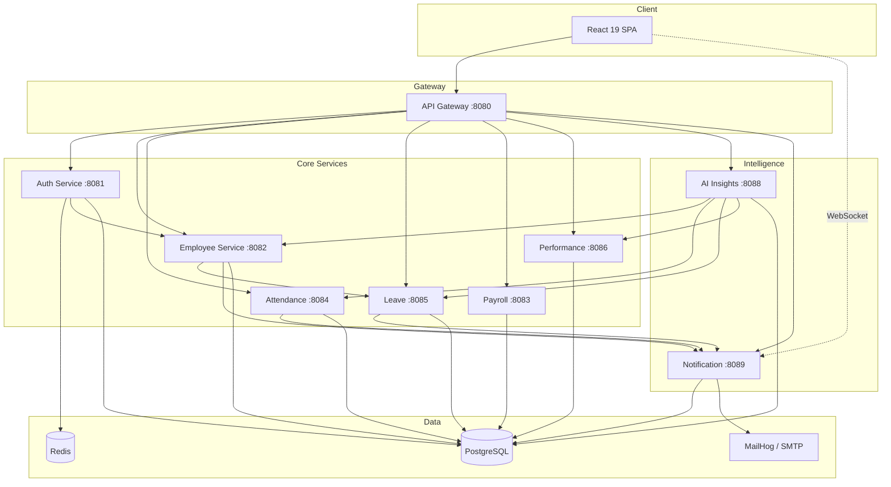
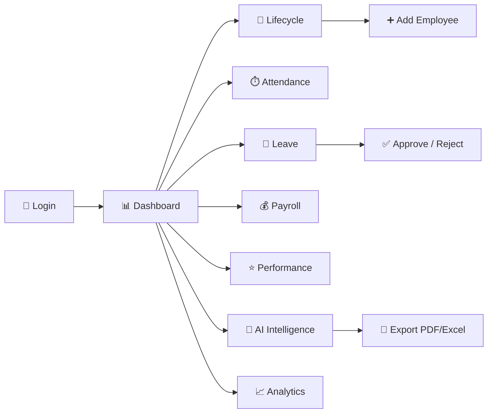

# 🏢 NexusHR — AI-Enabled Enterprise HR & Workforce Intelligence Platform

<div align="center">

### *"One Platform. Every Employee Journey. AI-Powered Decisions."*

[](https://openjdk.org/)
[](https://spring.io/projects/spring-boot)
[](https://reactjs.org/)
[](https://www.postgresql.org/)
[](https://www.docker.com/)
[](https://kubernetes.io/)
[](#-license)

**Zidio Development · June 2026**

</div>

---

## 📊 Quick Stats

<div align="center">

| 🧩 Microservices | 👥 RBAC Roles | 🤖 AI Modules | 📡 Real-time |
|:----------------:|:-------------:|:-------------:|:------------:|
| **9** | **4** | **5+** | **WebSocket + Email** |

</div>

---

## 🌟 What is NexusHR?

**NexusHR** is a **production-grade, microservices-based HR platform** built for modern enterprises. It unifies day-to-day HR operations with **AI workforce intelligence** — so HR teams, managers, and employees work from one secure system instead of scattered spreadsheets and tools.

### 🎯 Who It's For

```
✅ HR Teams        → Hire, onboard, offboard, announcements, payroll ops
✅ Managers        → Approve leave, review performance, monitor team health
✅ Employees       → Attendance, leave, payslips, profile, self-service workspace
✅ Admins          → Full platform access, analytics, workforce command center
✅ Leadership      → Attrition risk, engagement scores, department analytics, exports
```

### 💡 Problem We Solve

| Before NexusHR | With NexusHR |
|:---------------|:-------------|
| Manual onboarding checklists | Automated 4-step onboarding pipeline |
| No visibility into attrition risk | AI attrition & engagement scoring |
| Disconnected leave / payroll / attendance | Integrated microservices with notifications |
| HR-only data silos | Role-based dashboards for every persona |
| No audit trail on HR actions | JWT auth, RBAC, service-level security |

---

## ✨ Key Features

<table>
<tr>
<td width="50%">

### 👤 **Employee Lifecycle**
- HR **Add Employee** form (login + profile + onboarding)
- 4-step onboarding checklist (PROBATION → ACTIVE)
- Document upload (identity, tax, general)
- Offboard with login disable
- Self-service workspace activation

### ⏱️ **Time & Attendance**
- Clock in / clock out
- Daily attendance records
- Manager & HR visibility
- Real-time notifications on punch events

### 📅 **Leave Management**
- Submit, approve, reject, cancel leave
- Leave balance tracking per type
- Manager approval workflow
- Email + in-app alerts on status change

</td>
<td width="50%">

### 💰 **Payroll**
- Salary structures & payslip generation
- Employee payslip view & download
- HR payroll operations console
- INR-ready compensation breakdown

### ⭐ **Performance**
- Quarterly reviews & 360° feedback
- Manager review operations
- Scorecards & trend analytics
- Peer / self / manager feedback types

### 🧠 **AI Workforce Intelligence**
- Attrition risk predictions
- Engagement scoring
- Skill gap analysis
- Nexus AI assistant chat
- PDF / Excel workforce report export
- Scheduled report delivery

</td>
</tr>
</table>

---

## 🔐 Role-Based Access (RBAC)

<div align="center">

| Role | Email (Demo) | Key Capabilities |
|:-----|:-------------|:-----------------|
| **ADMIN** | `admin@nexushr.com` | Full access · Command Center · Lifecycle · Analytics |
| **HR** | `hr@nexushr.com` | Hire & onboard · Announcements · Payroll ops · AI insights |
| **MANAGER** | `manager@nexushr.com` | Team overview · Leave approval · Performance reviews |
| **EMPLOYEE** | `employee@nexushr.com` | Attendance · Leave · Payslips · Profile · AI assistant |

</div>

> Demo password for all accounts: **`NexusHR@2026`**

---

## 🏗️ Microservices Architecture



### Service Directory

| Service | Port | Responsibility |
|:--------|:----:|:---------------|
| **api-gateway** | 8080 | Routing, CORS, single entry point |
| **auth-service** | 8081 | JWT login/signup, refresh tokens, hire employee |
| **employee-service** | 8082 | Profiles, lifecycle, documents, departments |
| **payroll-service** | 8083 | Salary structures, payslip generation |
| **attendance-service** | 8084 | Clock in/out, attendance records |
| **leave-service** | 8085 | Leave requests, balances, approvals |
| **performance-service** | 8086 | Reviews, feedback, scorecards |
| **ai-insights-service** | 8088 | Attrition, engagement, skill gaps, reports |
| **notification-service** | 8089 | Email, in-app bell, WebSocket push |

---

## 🚀 Tech Stack

### **Backend**

```
┌──────────────────────────────────────────────────────┐
│              Java 21 + Spring Boot 3.5               │
├──────────────────────────────────────────────────────┤
│  Spring Cloud Gateway │ Spring Security │ Spring AI  │
├──────────────────────────────────────────────────────┤
│  PostgreSQL 16 │ Flyway │ Redis │ JWT │ Argon2       │
└──────────────────────────────────────────────────────┘
```

### **Frontend**

```
┌──────────────────────────────────────────────────────┐
│                 React 19 + TypeScript                │
├──────────────────────────────────────────────────────┤
│  Vite 8 │ Tailwind CSS 4 │ React Router 7            │
├──────────────────────────────────────────────────────┤
│  TanStack Query │ Recharts │ STOMP/WebSocket         │
│  Radix UI │ Lucide Icons │ Dark Mode                  │
└──────────────────────────────────────────────────────┘
```

### **DevOps & Observability**

| Technology | Purpose |
|:-----------|:--------|
| 🐳 **Docker** | Multi-stage builds, full stack compose |
| ☸️ **Kubernetes** | Deployments, HPA, Ingress |
| 🔄 **GitHub Actions** | CI (test + build) · CD (GHCR + EKS) |
| 📈 **Prometheus** | Metrics scraping |
| 📊 **Grafana** | Platform overview dashboards |
| 🔒 **OWASP ZAP** | Security baseline scanning |

---

## 📱 Application Pages



### Page Directory

| Route | Page | Roles | Description |
|:------|:-----|:------|:------------|
| `/login` | LoginPage | Guest | JWT authentication |
| `/signup` | SignupPage | Guest | Self-registration + auto profile |
| `/dashboard` | DashboardRouter | All | Role-aware home redirect |
| `/dashboard/hr-admin` | HrAdminDashboardPage | HR, Admin | Workforce command center |
| `/dashboard/manager` | ManagerDashboardPage | Manager+ | Team metrics & pending actions |
| `/dashboard/employee` | EmployeeDashboardPage | Employee | Personal workspace |
| `/dashboard/lifecycle` | EmployeeLifecyclePage | HR, Admin | **Add employee**, onboarding, offboard |
| `/dashboard/announcements` | HrAnnouncementsPage | HR, Admin | Broadcast email + in-app alerts |
| `/dashboard/directory` | EmployeeDirectoryPage | Manager+ | Employee directory |
| `/dashboard/attendance` | AttendancePage | All | Clock in/out & history |
| `/dashboard/leave` | LeaveManagementPage | All | Submit & manage leave |
| `/dashboard/payroll` | PayrollPage | All | View payslips |
| `/dashboard/payroll/operations` | HrPayrollPage | HR, Admin | Payroll operations |
| `/dashboard/performance` | PerformancePage | All | Reviews & feedback |
| `/dashboard/intelligence` | WorkforceIntelligencePage | Manager+ | AI attrition & engagement |
| `/dashboard/ai-assistant` | AiAssistantPage | All | Nexus AI chat assistant |
| `/dashboard/analytics` | AnalyticsReportsPage | Manager+ | Charts, drill-down, export |
| `/dashboard/notifications` | NotificationsPage | All | Notification history |
| `/dashboard/profile` | ProfileSettingsPage | All | Work profile & login settings |

---

## 🛠️ Installation & Setup

### Prerequisites

```bash
Java 21+
Maven 3.9+
Node.js 22+
npm 10+
Docker & Docker Compose
PostgreSQL 16 + Redis 7 (via Docker Compose)
```

### 1. Clone the repository

```bash
git clone https://github.com/YOUR_USERNAME/AI-Enabled-Enterprise-HR-Workforce-Intelligence-Platform.git
cd AI-Enabled-Enterprise-HR-Workforce-Intelligence-Platform
```

### 2. Start infrastructure

```bash
docker compose up -d    # PostgreSQL, Redis, MailHog
```

| Service | URL |
|:--------|:----|
| MailHog UI | http://localhost:8025 |
| PostgreSQL | localhost:5432 |
| Redis | localhost:6379 |

### 3. Run backend services

```bash
# Build all modules
mvn clean install -DskipTests

# Run each service (or use IDE run configs)
mvn -pl api-gateway spring-boot:run      # :8080
mvn -pl auth-service spring-boot:run     # :8081
mvn -pl employee-service spring-boot:run # :8082
mvn -pl payroll-service spring-boot:run  # :8083
mvn -pl attendance-service spring-boot:run # :8084
mvn -pl leave-service spring-boot:run   # :8085
mvn -pl performance-service spring-boot:run # :8086
mvn -pl ai-insights-service spring-boot:run # :8088
mvn -pl notification-service spring-boot:run # :8089
```

> Flyway migrations run automatically on first startup per service.

### 4. Run frontend

```bash
cd frontend
npm ci
npm run dev
```

Open **http://localhost:5173**

### Available Scripts

| Command | Location | Description |
|:--------|:---------|:------------|
| `mvn verify` | Root | Run all backend tests |
| `mvn -pl auth-service spring-boot:run` | Root | Start individual service |
| `npm run dev` | frontend/ | Start Vite dev server |
| `npm run build` | frontend/ | Production build |
| `npm run lint` | frontend/ | ESLint checks |
| `./scripts/build-docker.sh` | Root | Build all Docker images |
| `./scripts/load-test.sh` | Root | Gateway load test |
| `./scripts/security/zap-baseline.sh` | Root | OWASP ZAP scan |

---

## 🐳 Docker — Full Stack

```bash
cp .env.example .env
chmod +x scripts/build-docker.sh
./scripts/build-docker.sh
docker compose --profile app up -d --build
```

| Endpoint | URL |
|:---------|:----|
| Frontend | http://localhost:5173 |
| API Gateway | http://localhost:8080 |
| MailHog | http://localhost:8025 |

### Monitoring profile

```bash
docker compose --profile app --profile monitoring up -d
```

| Tool | URL | Credentials |
|:-----|:----|:------------|
| Prometheus | http://localhost:9090 | — |
| Grafana | http://localhost:3001 | admin / admin |

---

## ☸️ Kubernetes Deployment

```bash
kubectl apply -f k8s/namespace.yaml
kubectl apply -f k8s/configmap.yaml
cp k8s/secrets.example.yaml k8s/secrets.yaml   # edit values first
kubectl apply -f k8s/secrets.yaml
kubectl apply -f k8s/deployments.yaml
kubectl apply -f k8s/hpa.yaml
kubectl apply -f k8s/ingress.yaml
```

HPA auto-scales **api-gateway**, **auth-service**, and **employee-service** (2–10 pods on CPU/memory).

AWS EKS + S3 production guide: [`deploy/aws/README.md`](deploy/aws/README.md)

---

## 🔄 CI/CD

| Workflow | Trigger | Actions |
|:---------|:--------|:--------|
| [`.github/workflows/ci.yml`](.github/workflows/ci.yml) | Push/PR → `main` | Maven tests · frontend lint+build · Docker smoke |
| [`.github/workflows/cd.yml`](.github/workflows/cd.yml) | Tag `v*.*.*` | Push images to GHCR · optional EKS deploy |

---

## 📂 Project Structure

```
AI-Enabled-Enterprise-HR-Workforce-Intelligence-Platform/
├── 📁 api-gateway/              # Spring Cloud Gateway (8080)
├── 📁 auth-service/             # JWT auth, signup, hire employee
├── 📁 employee-service/         # Profiles, lifecycle, documents
├── 📁 attendance-service/       # Clock in/out
├── 📁 leave-service/            # Leave requests & balances
├── 📁 payroll-service/          # Payslips & salary
├── 📁 performance-service/      # Reviews & feedback
├── 📁 ai-insights-service/      # AI analytics & reports
├── 📁 notification-service/     # Email + WebSocket notifications
├── 📁 nexusHR-common/           # Shared enums & DTOs
├── 📁 frontend/                 # React 19 SPA
│   ├── src/
│   │   ├── components/          # UI, dashboard, HR forms
│   │   ├── pages/               # Route pages per role
│   │   ├── hooks/               # TanStack Query hooks
│   │   ├── lib/api/             # REST API clients
│   │   ├── contexts/            # Auth context
│   │   └── types/               # TypeScript types
│   └── package.json
├── 📁 docker/                   # Multi-stage Dockerfiles
├── 📁 k8s/                      # Kubernetes manifests + HPA
├── 📁 monitoring/               # Prometheus + Grafana config
├── 📁 deploy/aws/               # EKS deployment guide
├── 📁 scripts/                  # Build, load test, ZAP, DB init
├── 📁 docs/
│   ├── API_DOCUMENTATION.md     # Full REST API reference
│   └── WEEK4-QA-CHECKLIST.md    # Pre-submission QA
├── 📄 docker-compose.yml
├── 📄 pom.xml
└── 📄 README.md
```

---

## 📖 API Documentation

Full REST reference with request/response examples:

👉 **[`docs/API_DOCUMENTATION.md`](docs/API_DOCUMENTATION.md)**

Key endpoints:

| Method | Endpoint | Description |
|:-------|:---------|:------------|
| `POST` | `/api/v1/auth/login` | Login & get JWT |
| `POST` | `/api/v1/auth/hire` | HR hire employee (login + profile) |
| `GET` | `/api/v1/employees/me` | Current employee profile |
| `POST` | `/api/v1/employees/{id}/offboard` | Offboard employee |
| `POST` | `/api/v1/leaves` | Submit leave request |
| `GET` | `/api/v1/insights/attrition` | AI attrition predictions |
| `POST` | `/api/v1/notifications/dispatch` | HR broadcast announcement |

---

## ⚙️ Configuration

| File | Purpose |
|:-----|:--------|
| `.env.example` | Environment variable template |
| `*/application.properties.example` | Per-service config templates |
| `k8s/secrets.example.yaml` | Kubernetes secrets template |

```bash
# Copy and customize — never commit real secrets
cp .env.example .env
cp auth-service/src/main/resources/application.properties.example \
   auth-service/src/main/resources/application.properties
```

Key variables:

```bash
JWT_SECRET=your-jwt-secret
DB_URL=jdbc:postgresql://localhost:5432/nexus_auth_db
DB_USERNAME=postgres
DB_PASSWORD=your-password
EMPLOYEE_INTERNAL_KEY=nexushr-internal-dev-key
NOTIFICATIONS_ENABLED=true
```

---

## 🧪 QA & Security

Pre-submission checklist: [`docs/WEEK4-QA-CHECKLIST.md`](docs/WEEK4-QA-CHECKLIST.md)

```bash
# Backend tests
mvn verify

# Frontend build
cd frontend && npm run build

# Load test
./scripts/load-test.sh

# Security scan (requires Docker)
./scripts/security/zap-baseline.sh
# Report: reports/zap/zap-baseline-report.html
```

---

## 📈 Roadmap

### ✅ Phase 1 — Core HR Platform (Completed)
- [x] JWT auth with RBAC (Admin, HR, Manager, Employee)
- [x] Employee lifecycle — hire, onboard, offboard
- [x] Attendance, leave, payroll, performance modules
- [x] Real-time notifications (email + in-app + WebSocket)
- [x] Role-based React dashboards

### ✅ Phase 2 — AI & Intelligence (Completed)
- [x] Attrition risk scoring
- [x] Engagement analytics
- [x] Skill gap analysis
- [x] Nexus AI assistant
- [x] PDF / Excel workforce report export

### ✅ Phase 3 — DevOps & Production (Completed)
- [x] Docker multi-stage builds
- [x] Docker Compose full stack
- [x] Kubernetes manifests + HPA
- [x] GitHub Actions CI/CD
- [x] Prometheus + Grafana monitoring
- [x] OWASP ZAP security baseline

### 🔮 Phase 4 — Future Enhancements
- [ ] SSO / OAuth2 (Google, Microsoft)
- [ ] Mobile app (React Native)
- [ ] Recruitment & applicant tracking (ATS)
- [ ] Multi-tenant SaaS architecture
- [ ] Advanced LLM integration (OpenAI / Azure)
- [ ] Biometric attendance integration

---

## 🤝 Contributing

```bash
# 1. Fork the repository
# 2. Create a feature branch
git checkout -b feature/your-feature

# 3. Make changes and test
mvn verify
cd frontend && npm run build

# 4. Commit and push
git commit -m "✨ Add your feature"
git push origin feature/your-feature

# 5. Open a Pull Request
```

### Areas for Contribution

- 🧪 **Testing** — Integration & E2E test coverage
- 🎨 **UI/UX** — Dashboard polish & accessibility
- 🤖 **AI** — Better LLM prompts & model integration
- 📱 **Mobile** — Responsive PWA improvements
- 🌍 **i18n** — Hindi / regional language support
- 📖 **Docs** — Video tutorials & API examples

---

## 🐛 Known Issues

- [ ] Services must be started individually in local dev (no single `docker compose` for all JVM services without `--profile app`)
- [ ] AI insights use heuristic fallback when no LLM API key is configured
- [ ] Grafana runs on port **3001** (not 3000) to avoid local port conflicts

---

## 📄 License

Academic project — **Zidio Development, June 2026**.

For educational and portfolio purposes. Not licensed for commercial redistribution without permission.

---

## 🙏 Acknowledgments

- **Spring Team** — Spring Boot & Spring Cloud ecosystem
- **React Team** — React 19 framework
- **TanStack** — React Query for server state
- **Tailwind Labs** — Tailwind CSS v4
- **Zidio Development** — Project mentorship & submission framework

---

<div align="center">

### 🌟 Star this repository if you found it helpful!

**Made with ❤️ for smarter HR operations**

*Empowering HR teams with AI-driven workforce intelligence*

---

**[⬆ Back to Top](#-nexushr--ai-enabled-enterprise-hr--workforce-intelligence-platform)**

</div>
